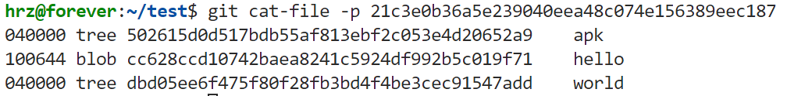
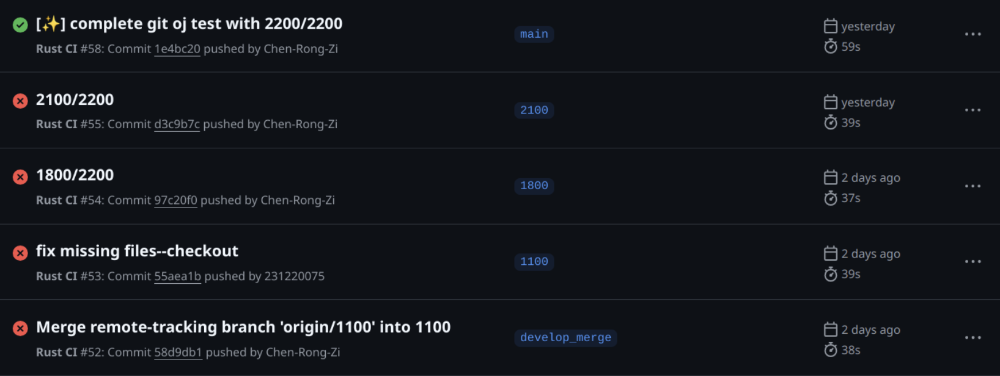

# 📝 用rust复刻git

> 本文将介绍用rust复刻git的历程，也纪念我第一次合作开发的经历

## 前言

大二下选课的时候发现有一门《rust程序设计》的课程，之前在大一上c++的时候最早接触过rust这个名字，但是一直没怎么了解过，于是抱着好奇心和同伴组队选了这门课，这也是这门项目的由来。

整个项目从4月份开始，到5月底向猪脚答辩时完成了1.0版本（`https://github.com/231220075/git.git`），包含了除远程分支外的基本功能。后续在暑假期间补上了远程分支控制的部分，即1.1版本（`https://github.com/231220075/rit.git`），命名为rit->rust-git。

## 初步开发
- 首先需要了解git的工作原理，这一部分参考`https://git-scm.com/book/en/v`，不再赘述。
- 每一条git命令执行过程比较固定，解析好命令行参数后执行对应的处理函数即可。解析命令行参数使用clap（易于使用，能处理复杂参数解析，且自动生成help页）。clap解析命令行参数并返回具体类型的 subcommand，并调用其run函数。这里为了后续子命令的实现，我们把.git所在目录路径作为参数传给run，并为-C做了处理。
- 在做subcommand之前需要先实现一些底层命令，我们做了cat-file、hash-object、write/read-tree、update-index、commit-tree、update-ref&&symboloc-ref等等（后两个比较简单，后续直接简化到utils/refs作为分支管理工具了），这一部分逐步理清并构建了git的工作环境，如index区、.git文件内容管理、refs管理等等，以及git中 blob、tree、commit这几种object的结构，这些就是git的底层代码，到此为止我们就能完全读懂.git下的所有文件及其功能了。
- 理解底层代码后剩下的部分就比较简单了，subcommand就是在底层命令的基础上运行的，基本就是组合一下，加上判断处理。比较复杂的可能是checkout和merge，课程对merge要求比较简单，如果有冲突只要显示两个分支哪部分有不同，这部分由另一位成员完成，我不做过多阐述；而checkout主要涉及到切换分支的时间点，workspace、index和ref commit是否一致的问题。我的理解是，如果切换分支前，仅考虑目标文件，index=workspace=current ref commit，说明不存在未暂存&&未提交的更改，即index和workspace都是clean，这种情况下可以直接切换ref commit,并把目标commit的tree object写入index和更新workspace；否则说明有未暂存||未提交的更改，需要考虑保留这些更改，存在一个“merge”的过程，对于存在冲突的文件以index/workspace为准。
- 这个过程中每一步开发新功能前需要先把频繁使用的method构建一个util，方便后续使用，我们主要是用到很多关于三类object构建和读写、index的读写、文件读写以及压缩、hash和做单元测试的method，构建了相关的utils。谈到unit test，需要感谢我的同伴开发了完整的测试框架，为我们的测试做出来巨大的贡献、巨大的carry，respect！也是rust优秀的单元测试让我这个懒人也愿意开始做测试了，amazing啊qwq。

## debug&&踩坑
- 关于debug，包括两部分。一是客观方面作为课设，猪脚还是做了oj，我们这个项目需要通过测试拿分。猪脚的oj是用脚本做断言测试公开了部分测试和要求，涉及大文件、可执行文件、图片等的测试；另一方面主观上每个subcommand和底层命令我们做了对应的集成测试，主要是交替使用原版git和rust-git检查问题。
- 大部分bug在检测的过程中就知道哪里有问题，可以快速解决，但有的是认知问题。比较典型的是，index区暂存文件的结构和tree object的文件结构是不一样的，前者是完整的路径，而后者是递归存储的。
- 另外就是配置了GitHub的CI，
  ```yaml

  name: Rust CI

  # 触发条件：当代码推送到仓库或创建 Pull Request 时触发
  on:
    push:
      branches: [ '**' ]

  jobs:
    build-and-test:
      runs-on: ubuntu-latest  # 使用最新的 Ubuntu 环境

      steps:
        # Step 1: 检出代码
        - name: Checkout code
          uses: actions/checkout@v3

        # Step 2: 设置 Rust 工具链
        - name: Set up Rust
          uses: actions-rs/toolchain@v1
          with:
            toolchain: stable  # 使用稳定的 Rust 工具链

        # Step 3: 运行 cargo test
        - name: Run Tests
          run: cargo test -- --test-threads=1

        # Step 4: 运行 cargo clippy 检查
        - name: Run Clippy
          run: cargo clippy -- -D warnings  # 将警告视为错误

        # （可选）Step 5: 构建项目
        - name: Build Project
          run: cargo build --release
  ```
  这样每次提交自动触发测试，虽然每次都要发个邮件提醒有点烦就是了……
  大概如下

## 🤖️ 远程分支
- 进入8月才有时间收拾这个没完成的摊子，想补充的远程分支部分主要是fetch、pull和push三个subcommand，目标是能和GitHub的repo交互更新即可。
- 我最终选择用https与GitHub传输，虽然传输大文件不稳定，但是本人对https比较熟悉（ssh现阶段就不太考虑了）。fetch主要是获取远程仓库的分支和对应的commit hash，而首先要设定远程传输的仓库URL，所以先实现remote指令设置分支和URL的映射，保存在.git/config文件。fetch同样可以指定参数，选择获取所有远程分支还是特定远程分支，然后创建“.git/refs/remote/分支名”文件，记录其commit hash。
- 而pull则是fetch+merge，先获取远程分支，然后将当前分支与目标分支合并。有一个需要注意的点是，在init后remote add&&pull，此时本地分支因为没有提交过，refs下并没有默认的master/main文件，因为没有提交过、没有commit hash，此时要做merge会出现问题，既没有本地分支也没有index区，我之前的实现会merge fail。所以我取巧了一下，如果是初始化之后直接pull的这种情况，直接fetch+checkout到远程分支；而push则协商需要传输的对象，并创建pack文件通过https传输。
- 需要注意的地方主要有两点：一是pull下来的pack需要解压缩，这个解压缩器的设计需要比较精确，完全理解git的压缩pack的逻辑才能设计足够精确的解压器、才能完全解压出100%的object，否则会丢失部分object产生缺损；二是所有的pack在push上去后都会被GitHub端接收，需要严格遵循格式，我在此过程中有两个问题，tree object的文件组织格式（没错，正是前文提到的）和index&&tree object中表项没按字典序排序。说实话之前在和原版git比对的时候也注意到了这个顺序问题，但当时感觉没什么影响，现在被教训了，只能说一切都有其存在的意义

---

*感谢阅读！如果这篇文章对你有帮助，欢迎点赞和分享。*
